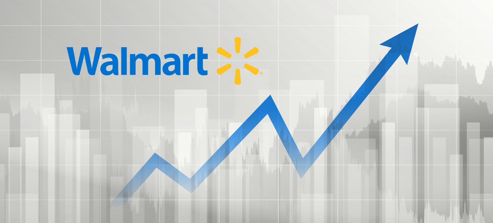

# Walmart-Sale-Forecasting

## Description:
This project focuses on building a model to forecast the weekly sales for Walmart stores across the United States. The project includes data preprocessing, feature engineering, model training, and evaluation to deliver accurate predictions.

The Dataset is from: https://www.kaggle.com/code/avelinocaio/walmart-store-sales-forecasting/data

## About the Data:
Datasets: [Walmart - Store Sales Forecasting](https://www.kaggle.com/code/avelinocaio/walmart-store-sales-forecasting/data)

We are provided with historical sales data for 45 Walmart stores located in different regions. Each store contains a number of departments, and you are tasked with predicting the department-wide sales for each store.

In addition, Walmart runs several promotional markdown events throughout the year. These markdowns precede prominent holidays, the four largest of which are the Super Bowl, Labor Day, Thanksgiving, and Christmas. The weeks including these holidays are weighted five times higher in the evaluation than non-holiday weeks. Part of the challenge presented by this competition is modeling the effects of markdowns on these holiday weeks in the absence of complete/ideal historical data.
